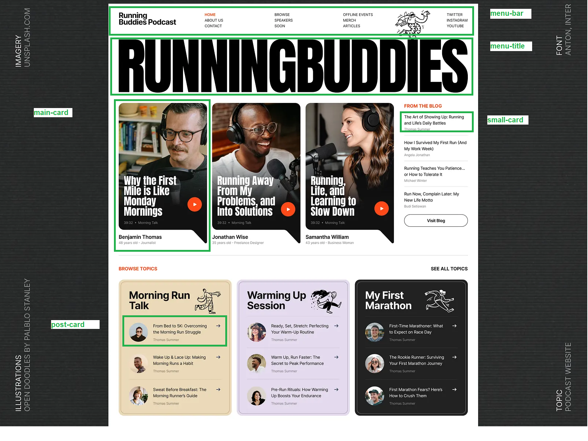

# 🎙️ Inspirational Podcast

> Um blog desenvolvido em **Angular** como parte do bootcamp **Decolar Tech 2025 Avanade** com a **DIO**. O projeto foca na criação de componentes, uso do NG CLI, TypeScript, lifecycle dos componentes e boas práticas de desenvolvimento.

## 📜 Índice

- [🎯 Sobre o Projeto](#-sobre-o-projeto)
- [🎨 Inspiração do Design](#-inspiração-do-design)
- [🚀 Tecnologias Utilizadas](#-tecnologias-utilizadas)
- [📌 Desafios e Aprendizados](#-desafios-e-aprendizados)
- [📅 Próximos Passos](#-próximos-passos)
- [⚙️ Instalação e Execução](#️-instalação-e-execução)
- [🤝 Contribuição](#-contribuição)
- [📄 Licença](#-licença)

---

## 🎯 Sobre o Projeto

O **Inspirational Podcast** é um blog criado para praticar e consolidar os conhecimentos adquiridos no bootcamp **Decolar Tech 2025 Avanade**. O projeto abrange conceitos fundamentais do **Angular**, como:

- Estrutura de projetos
- Uso do **NG CLI**
- Web components (**HTML, CSS, DOM**)
- Componentização
- **TypeScript** (tipos, funções, interfaces, classes, generics)
- Lifecycle dos componentes
- Boas práticas de desenvolvimento

## 🎨 Inspiração do Design

O design do blog foi inspirado no modelo disponível no Dribbble:

🔗 [Podcast Design Exploration](https://dribbble.com/shots/24943214-Podcast-Design-Exploration)



A partir dessa inspiração, o projeto foi construído utilizando **Angular** e adotando a criação de componentes e interações para um desenvolvimento eficiente.

## 🚀 Tecnologias Utilizadas

O projeto utiliza as seguintes tecnologias:

- **Angular**
- **HTML, CSS**
- **Node.js**
- **TypeScript**
- **Git e GitHub** (para versionamento)

## 📌 Desafios e Aprendizados

### ✅ Autonomia
- Cerca de **95% da estilização** foi desenvolvida de forma independente, utilizando **CSS e HTML**.
- Algumas dúvidas foram resolvidas consultando aulas e documentações para ajustes avançados.

### 🔍 Curiosidade e Inovação
- Primeiro projeto utilizando **Angular**.
- Aplicação dos conceitos aprendidos nas aulas e aproveitamento da experiência prévia com **React**.

## 📅 Próximos Passos

- [ ] Concluir a estilização das páginas e componentes
- [ ] Criar as rotas da aplicação
- [ ] Implementar conteúdo dinâmico para os posts exibidos na página inicial

## ⚙️ Instalação e Execução

### 📥 Pré-requisitos

Antes de começar, certifique-se de ter as seguintes ferramentas instaladas:

- [Node.js](https://nodejs.org/) e [npm](https://www.npmjs.com/)
- [Angular CLI](https://angular.io/cli)
- Git

### 🛠️ Como rodar o projeto

1. **Clone este repositório**
   ```bash
   git clone https://github.com/dominuuus/Inspiration-Blog.git
